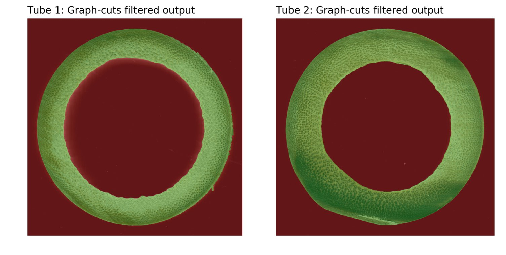

# 🎍 bamboleo
Tools for extracting bamboo tube cross-sections, which can later be used to generate 3D printed structural fittings.

## Image Pipeline Overview

### Input
The user provides:
* A scanned image which contains the cross section of one or multiple tubes placed in the bed of a flatbed scanner.
* The dots-per-inch value used to scan the image used to compute real scale measurements from pixel values.

The background should be black, which can be obtained by placing a matte black box on top of the bamboo cuts.

 
 

### Step 1: Detection of individual tubes
The first stage recognizes the different tubes in the scanned image so they can be processed separatly.
A [flood fill](https://en.wikipedia.org/wiki/Flood_fill) operation is performed (think MS Paint bucket) to obtain a coarse binary mask:
 

This mask is later filtered using [morphological](https://en.wikipedia.org/wiki/Opening_(morphology)) operations to remove noise, and the contours of the remaining islands are obtained. The islands are filtered based on some basic rules such as minimum tube size and aspect ratio. Finally the crop of each tube is sent to the next stage for processing. 
 

### Step 2: Extraction of tube contours
At this point each tube is processed independently.

The [graph-cuts optimization algorithm](https://docs.opencv.org/trunk/d8/d83/tutorial_py_grabcut.html) is used to perform image segmentation, labeling the pixels of each crop as "tube" or "background".

The original coarse contour is scaled multiple times to generate the input annotation. In the sample image the pixels marked red are determined to be "background" and the green pixels are "tube":
 

After executing graph-cuts and morphologically filtering the output mask the final labels are obtained:
 

### Results
The contours of the final labeled image are obtained and the polygons are simplified to reduce unnecesarry complexity.
On this output image the outside contours are drawn in purple while the inside contours are drawned in yellow.

 

At this point it is possible to obtain metrics of each cross section, including diameters, perimeter, solidity, aspect ratio, etc.

The final contours are experted as [AutoCAD DXF](https://en.wikipedia.org/wiki/AutoCAD_DXF) vector files to be imported by 3D modelling software. Output files for the [first](doc/tube0.dxf) and [second](doc/tube1.dxf).
